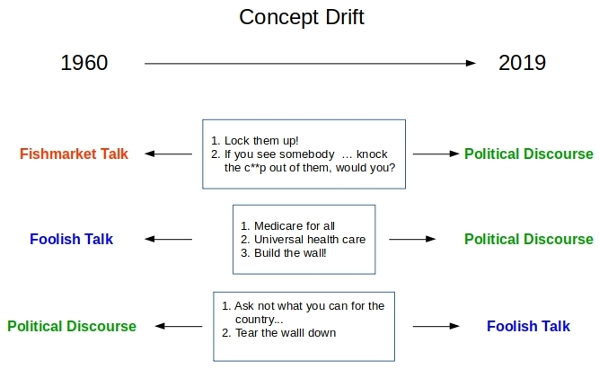
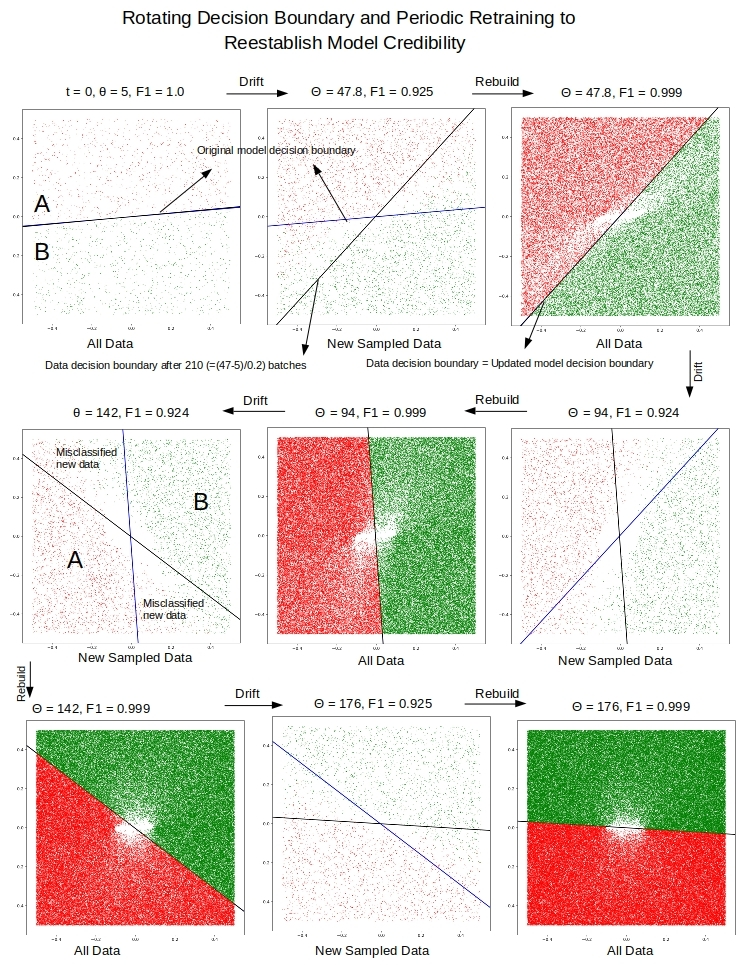
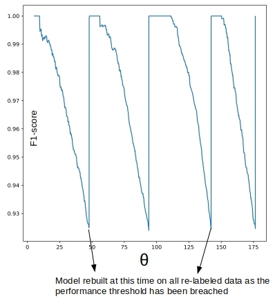

# Concept Drift and Model Decay in Machine Learning

This is the source code to go along with the blog article

[Concept Drift and Model Decay in Machine Learning](http://xplordat.com/2019/04/25/concept-drift-and-model-decay-in-machine-learning/)

Concept drift is a drift of labels with time for the essentially the same data.

It leads to the divergence of decision boundary for new data from that of a model built from earlier data/labels. Scoring randomly sampled new data can detect the drift allowing us to trigger the expensive re-label/re-train tasks on an as needed basis…

An example of concept drift would look like:

## Dependencies

	numpy
	scikit-learn
	matplotlib

## Usage

The following will simulate concept drift in 2-d, 2-class situation where the linear decision boundary rotates by 0.2 degrees with each new batch of data.

	pipenv run python ./concept-drift.py 1000

The morphing of the decision boundary for new data can be detected by sampling the new data. When the predictive ability of the model sinks below a threshold, we re-label the data and retrain the model.

## Model decay and recovery

The loss of predictive ability of the model can be used to trigger the re-label and re-train tasks.

